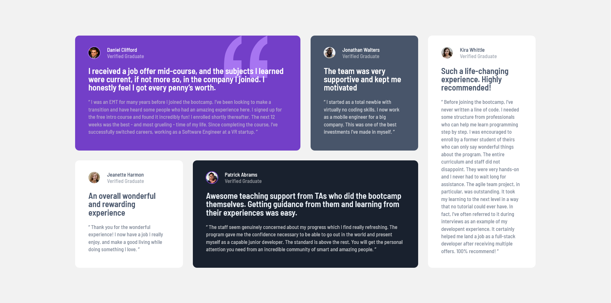

# Frontend Mentor - Testimonials grid section solution

This is a solution to the [Testimonials grid section challenge on Frontend Mentor](https://www.frontendmentor.io/challenges/testimonials-grid-section-Nnw6J7Un7). Frontend Mentor challenges help you improve your coding skills by building realistic projects. 

## Table of contents

- [Frontend Mentor - Testimonials grid section solution](#frontend-mentor---testimonials-grid-section-solution)
  - [Table of contents](#table-of-contents)
  - [Overview](#overview)
    - [The challenge](#the-challenge)
    - [Screenshot](#screenshot)
    - [Links](#links)
  - [My process](#my-process)
    - [Built with](#built-with)
    - [What I learned](#what-i-learned)
    - [Useful resources](#useful-resources)
  - [Author](#author)
  - [Acknowledgments](#acknowledgments)

## Overview

### The challenge

Users should be able to:
- View the optimal layout for the site depending on their device's screen size

### Screenshot



### Links

- Solution URL: [GitHub](https://github.com/dantvi/testimonials-grid-section)
- Live Site URL: [DT Code](https://testimonials-grid-section.dtcode.se/)

## My process

### Built with

- Semantic HTML5 markup
- CSS custom properties for reusable theming
- CSS Grid for complex layout designs
- Mobile-first workflow for responsive design
- Multiple background images for styling without absolute positioning
- Figma design files for accurate implementation

### What I learned

- CSS Grid:
  - Learned to create complex layouts and organize elements for different screen sizes using grid-template-areas and grid-template-columns.
- Responsive Design:
  - Improved my ability to create layouts that adapt seamlessly across devices using media queries.
- Multiple Backgrounds:
  - Used CSS multiple background images to position decorative elements, such as the quotation mark in the "Daniel Clifford" card.
- Styling Hierarchy:
  - Applied layered color schemes and border styling for individual cards to enhance the visual design.

Here’s an example of the CSS I used for the responsive grid layout:

```css
.content {
    max-width: 111rem;
    display: grid;
    margin: 5%;
    gap: 2.4rem;
}

@media screen and (min-width: 960px) {
    .content {
        margin: 0 2%;
        grid-template-columns: repeat(4, 1fr);
    }

    #daniel {
        grid-area: 1 / 1 / 2 / 3;
        background: 
        url(../images/bg-pattern-quotation.svg) no-repeat top right 8rem,
        linear-gradient(
            rgba(115, 63, 200, 1), 
            rgba(115, 63, 200, 1)
        );
    }
}
```

### Useful resources

- [CSS Grid Layout Guide from CSS-TRICKS](https://css-tricks.com/snippets/css/complete-guide-grid/) - This is a great resource to learn more about CSS grid and to keep as a future reference.
- [MDN Web Docs: Media Queries](https://developer.mozilla.org/en-US/docs/Web/CSS/CSS_media_queries/Using_media_queries) - Helped refine the responsive design for tablet and desktop layouts.

## Author

- Portfolio - [Daniel Tving](https://dantvi.github.io/personal-portfolio-webpage/)
- Frontend Mentor - [@dantvi](https://www.frontendmentor.io/profile/dantvi)
- GitHub - [@dantvi](https://github.com/dantvi)

## Acknowledgments

Thanks to Frontend Mentor for providing this excellent challenge. The project helped me practice and refine my skills with CSS Grid and responsive design while encouraging me to think creatively about layout styling.
